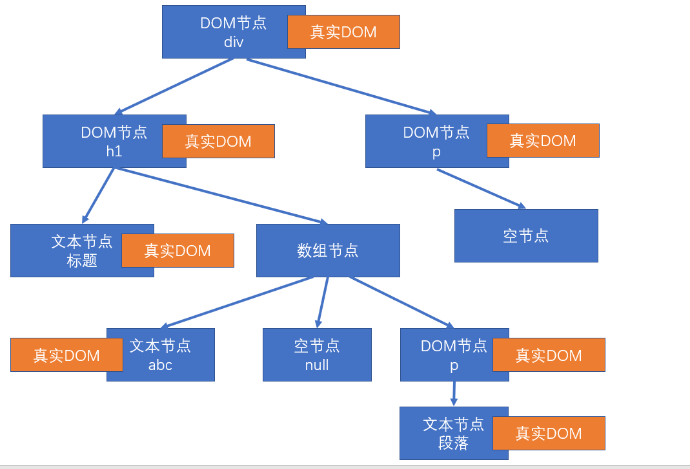

# 渲染

渲染：生成用于显示的对象，以及将这些对象形成真实的DOM对象

- React元素：React Element，通过React.createElement创建（语法糖：JSX）
  - 例如：
  - ```<div><h1>标题</h1></div>```
  - ```<App />```
- React节点：专门用于渲染到UI界面的对象，React会通过React元素，创建React节点，ReactDOM一定是通过React节点来进行渲染的
- 节点类型：
  - React DOM节点：创建该节点的React元素类型是一个字符串
  - React 组件节点：创建该节点的React元素类型是一个函数或是一个类
  - React 文本节点：由字符串、数字创建的
  - React 空节点：由null、undefined、false、true
  - React 数组节点：该节点由一个数组创建
- 真实DOM：通过document.createElement创建的dom元素


## 首次渲染(新节点渲染)

1. 通过参数的值创建节点
2. 根据不同的节点，做不同的事情
   1. 文本节点：通过document.createTextNode创建真实的文本节点
   2. 空节点：什么都不做 
   3. 数组节点：遍历数组，将数组每一项递归创建节点（回到第1步进行反复操作，直到遍历结束）
   4. DOM节点：通过document.createElement创建真实的DOM对象，然后立即设置该真实DOM元素的各种属性，然后遍历对应React元素的children属性，递归操作（回到第1步进行反复操作，直到遍历结束）
   5. 组件节点 
      1. 函数组件：调用函数(该函数必须返回一个可以生成节点的内容)，将该函数的返回结果递归生成节点（回到第1步进行反复操作，直到遍历结束）
      2. 类组件：
         1. 创建该类的实例 
         2. 立即调用对象的生命周期方法：static getDerivedStateFromProps
         3. 运行该对象的render方法，拿到节点对象（将该节点递归操作，回到第1步进行反复操作）
         4. 将该组件的componentDidMount加入到执行队列（先进先出，先进先执行），当整个虚拟DOM树全部构建完毕，并且将真实的DOM对象加入到容器中后，执行该队列
3. 生成出虚拟DOM树之后，将该树保存起来，以便后续使用 
4. 将之前生成的真实的DOM对象，加入到容器中。

```js
const app = <div className="assaf">
    <h1>
        标题
        {["abc", null, <p>段落</p>]}
    </h1>
    <p>
        {undefined}
    </p>
</div>;
ReactDOM.render(app, document.getElementById('root'));
```

以上代码生成的虚拟DOM树：




```js
function Comp1(props) {
    return <h1>Comp1 {props.n}</h1>
}

function App(props) {
    return (
        <div>
            <Comp1 n={5} />
        </div>
    )
}

const app = <App />;
ReactDOM.render(app, document.getElementById('root'));
```

以上代码生成的虚拟DOM树：


```js
class Comp1 extends React.Component {
    render() {
        return (
            <h1>Comp1</h1>
        )
    }
}

class App extends React.Component {
    render() {
        return (
            <div>
                <Comp1 />
            </div>
        )
    }
}

const app = <App />;
ReactDOM.render(app, document.getElementById('root'));
```

以上代码生成的虚拟DOM树：


## 更新节点

更新的场景：

1. 重新调用ReactDOM.render，触发根节点更新
2. 在类组件的实例对象中调用setState，会导致该实例所在的节点更新

**节点的更新**

- 如果调用的是ReactDOM.render，进入根节点的**对比（diff）更新**
- 如果调用的是setState 
  - 1. 运行生命周期函数，static getDerivedStateFromProps
  - 2. 运行shouldComponentUpdate，如果该函数返回false，终止当前流程 
  - 3. 运行render，得到一个新的节点，进入该新的节点的**对比更新**
  - 4. 将生命周期函数getSnapshotBeforeUpdate加入执行队列，以待将来执行
  - 5. 将生命周期函数componentDidUpdate加入执行队列，以待将来执行

后续步骤： 
1. 更新虚拟DOM树 
2. 完成真实的DOM更新
3. 依次调用执行队列中的componentDidMount
4. 依次调用执行队列中的getSnapshotBeforeUpdate
5. 依次调用执行队列中的componentDidUpdate


### 对比更新

将新产生的节点，对比之前虚拟DOM中的节点，发现差异，完成更新

问题：对比之前DOM树中哪个节点

React为了提高对比效率，做出以下假设 

1. 假设节点不会出现层次的移动（对比时，直接找到旧树中对应位置的节点进行对比）
2. 不同的节点类型会生成不同的结构
   1. 相同的节点类型：节点本身类型相同，如果是由React元素生成，type值还必须一致
   2. 其他的，都属于不相同的节点类型
3. 多个兄弟通过唯一标识（key）来确定对比的新节点 

key值的作用：用于通过旧节点，寻找对应的新节点，如果某个旧节点有key值，则其更新时，会寻找相同层级中的相同key值的节点，进行对比。

**key值应该在一个范围内唯一（兄弟节点中），并且应该保持稳定**

#### 找到了对比的目标

判断节点类型是否一致


- **一致**

根据不同的节点类型，做不同的事情

**空节点**：不做任何事情

**DOM节点**：

1. 直接重用之前的真实DOM对象
2. 将其属性的变化记录下来，以待将来统一完成更新（现在不会真正的变化）
3. 遍历该新的React元素的子元素，**递归对比更新**

**文本节点**：

1. 直接重用之前的真实DOM对象
2. 将新的文本变化记录下来，将来统一完成更新

**组件节点**

**函数组件**：重新调用函数，得到一个节点对象，进入**递归对比更新**

**类组件**：

1. 重用之前的实例
2. 调用静态生命周期方法getDerivedStateFromProps
3. 调用生命周期方法shouldComponentUpdate，若该方法返回false，终止
4. 运行render，得到新的节点对象，进入**递归对比更新**
5. 将该对象的getSnapshotBeforeUpdate加入队列
6. 将该对象的componentDidUpdate加入队列

**数组节点**：遍历数组进行**递归对比更新**

- **不一致**

整体上，卸载旧的节点，全新创建新的节点

**创建新节点**

进入新节点的挂载流程

**卸载旧节点**

1. **文本节点、DOM节点、数组节点、空节点、函数组件节点**：直接放弃该节点，如果节点有子节点，递归卸载节点
2. **类组件节点**：
   1. 直接放弃该节点
   2. 调用该节点的componentWillUnMount函数
   3. 递归卸载子节点


#### 没有找到对比的目标

新的DOM树中有节点被删除

新的DOM树中有节点添加

- 创建新加入的节点
- 卸载多余的旧节点
